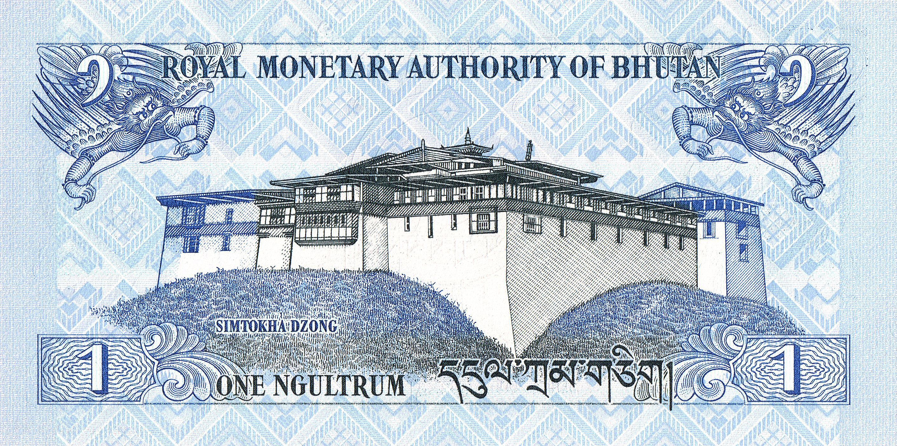

You know the game Scattergories? You roll a twenty-sided die labeled with letters instead of numbers, it lands on a letter, and you have to name something starting with that letter in a bunch of predetermined categories.

Let's play Scattergories, but instead of rolling a letter die, I choose the letter, and the letter is N. Quick, name one thing in each of these categories that starts with N:

{: class="img-big"}

| Category            | Possible answers                                          |
| :------------------ | :-------------------------------------------------------------------------------------------- |
| Animals             | Newt, narwhal, nightingale, nautilus, or naked mole rat           |
| Colors              | Navy blue or neon green                                           |
| Restaurant chains   | Nando's or Noodles & Company                                      |
| Sports              | Netball, Newcomb, or the only Olympic N sport, Nordic Combined    |
| Board or card games | Nerts, Nine men's morris, or Niagara                              |
| Flowers             | Narcissus or night-scented stock                                  |
| Musical instruments | Nose flute or nadaswaram                                          |
| Vegetables          | Napa cabbage or nopal, or maybe nori                              |
| Gemstones           | Good luck knowing nambulite or nephrite off the top of your head! |

That was... weirdly hard, wasn't it? N gives off common-letter vibes—it's one point in Scrabble, there are 8 of them in a Bananagrams pouch, it's one of the RSTLNE letters on _Wheel of Fortune_—so by all accounts this should've been easy. So then what's going on here? Why are all these super-normal categories so deficient in vitamin N?

## Numbers

I know what you're thinking: "Adam, you can't just cherry-pick a bunch of categories to prove your point!" And you're right! To do that, we're gonna need to look at the data.

For this data analysis, we're using the [ENABLE](https://github.com/dolph/dictionary/blob/master/enable1.txt) (Enhanced North American Benchmark LExicon) wordlist, a free-to-use 172,000-word English dictionary that's based on the _Official Scrabble Player's Dictionary_ but isn't throttled to words under a certain length. You probably don't recognize its name, but you may know its work—ENABLE is the base wordlist for [Words With Friends](https://wordswithfriends.com) and the default English dictionary on [Wordlisted](https://aaronson.org/wordlisted/). It's not perfect, but it's a representative enough survey of English words for our purposes.

Also, we're looking at the English dictionary in particular, not a natural language [corpus](https://en.wikipedia.org/wiki/Text_corpus), since we're more concerned with how many _different_ words there are rather than how _often_ a given word appears. That means letters like T and H won't be weighted for appearing in common words like _the_ and _that_, meaning our letter frequency ranking will look a little different than rankings that take word frequency into account, like the classic Linotype ordering [etaoin shrdlu](https://en.wikipedia.org/wiki/Etaoin_shrdlu).

So here are the letters of the alphabet ranked by how often they appear in the English dictionary. On the left is how often the letters appear overall, while on the right is how often they appear as the first letter of a word:

{: class="img-big"}

Immediately, you can see N plummeting: from the big leagues of overall letter frequency, down to the bowels of initial letter frequency, joining the likes of WVKJQYZX in the dregs of alphabet society.

Sidenote, it's eerie how similar these two graph's shapes are: despite having two completely different letter orderings, they both have three big leaders, six-ish more trailing behind, and then a steep dropoff into the long tail. [Zipf's law](https://en.wikipedia.org/wiki/Zipf%27s_law) is crazy like that.

Here's another way to visualize the same data, this time combining both distributions into one coordinate plane:

{: class="img-medium"}

The dotted line here indicates where every letter would be if letter frequency was uniform throughout the word, i.e. if initial letter frequency was the same as overall letter frequency. So the farther a letter is from that dotted line, you could say the farther its initial letter frequency strays from expectation.

As expected, there's the JQXZ crew hanging out at the bottom left, and S leagues ahead at the top right (thanks to plurals, and also just being an ultra-common starting letter). Way above the line, we see letters like P, C, B, and F, which are much more common as first letters than they are in general. Every vowel is below the line, which makes sense, since vowels are omnipresent but tend to be less common as starting letters. And then there's N, the farthest consonant below the line, the most disproportionately rare starting consonant in the alphabet.

They don't teach you this in school, folks. It almost feels wrong, like a forbidden piece of information, that N is such a rare first letter. So why might this be?

## Nailing it down

Let's consider a few prevailing theories, some combination of which explain why N is such an uncommon starting letter despite its overall commonness.

First, while N is undeniably a common letter in general, the bulk of its commonness is for reasons other than being at the beginning of words. Instead, its position in overall frequency rankings is inflated by the ubiquity of prefixes like _un-_ and _in-_, as well as suffixes like _-tion_ and _-ing_. In natural language, N's frequency is further bolstered by its appearance in ultra-common words like _in_, _an_, and _and_. N is everywhere, but it's not usually the letter in charge. In NBA terms, N is less of a star point guard and more of a reliable role player.

{: class="img-left"}

Second, N has less potential as an initial letter because of the lack of English consonant clusters beginning with N. Take a look at the most disproportionately common starting letters, the ones farthest above the dotted line of expectation: P, C, B, and F. They have one thing in common: they lead common consonant clusters like _pr-_, _ch-_, _bl-_, and _fl-_, giving them much more mileage in the initial position. But compared to all the cool consonants, N has nothing of the sort—the only words in the ENABLE wordlist that start with N followed by another consonant are _nth_, _ngwee_ (1/100 of a [kwacha](https://en.wikipedia.org/wiki/Zambian_kwacha), which is Zambia's official currency), and _ngultrum_(_s_) (whaddya know, Bhutan's official currency). Without consonant clusters, the priors for N as a first letter are lower, since there are fewer possible ways to construct a word starting with it.

{: class="img-right"}

Third, there is some historical phonological evidence that English words, especially nouns, have evolved away from starting with N. In English, we turn our indefinite article _a_ into _an_ when it's followed by a word that starts with a vowel sound, enabling great jokes like "You're going to Antarctica? Have an ice time!" But jokes aside, misunderstandings of N's placement have led to the actual evolution of words as we know them today, in a process called _faulty separation_ (also known as _false splitting_, a special case of [rebracketing](https://en.wikipedia.org/wiki/Rebracketing)). For instance, _an [apron](https://www.etymonline.com/word/apron)_ came from a misunderstanding of _a napron_, _an [umpire](https://www.etymonline.com/word/umpire)_ was once _a noumpere_, and _an [adder](https://www.etymonline.com/word/adder)_ was _a naddre_. Granted, this transformation has also happened the other way around, turning _an eft_ into _a [newt](https://www.etymonline.com/word/newt)_ and _an eke name_ into _a [nickname](https://www.etymonline.com/word/nickname)_. Still, it's likely that some of N's unpopularity as a first letter was destined by a natural selection process—or should I say, an atural selection process.

## Now what?

Now you know that N is a lowkey rare first letter, and you can tell your friends about it, and they can be like, "neat!" That's pretty much it. I don't know, did you think there would be some higher purpose to a blog post about the letter N?

I mean, if you're making a crossword, be careful putting an entry with a bunch of N's in it at 1-Across. If you're writing an acrostic poem or an alphabet book, make sure you have something good for N before you get in too deep. And maybe, if you're playing Scattergories and the die lands on N, roll again.
