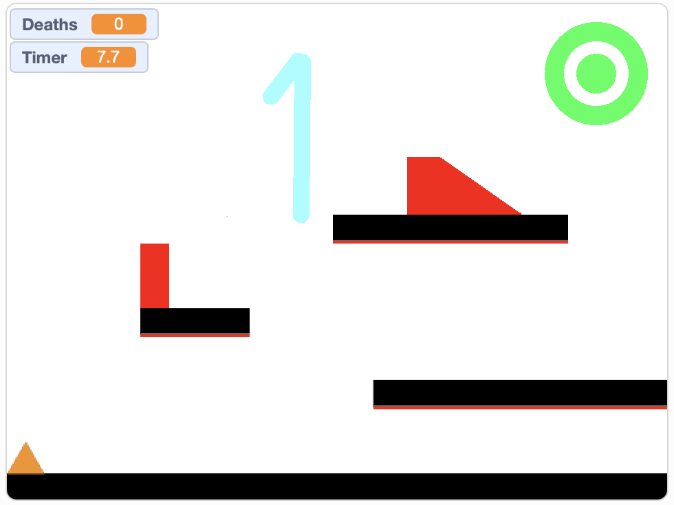
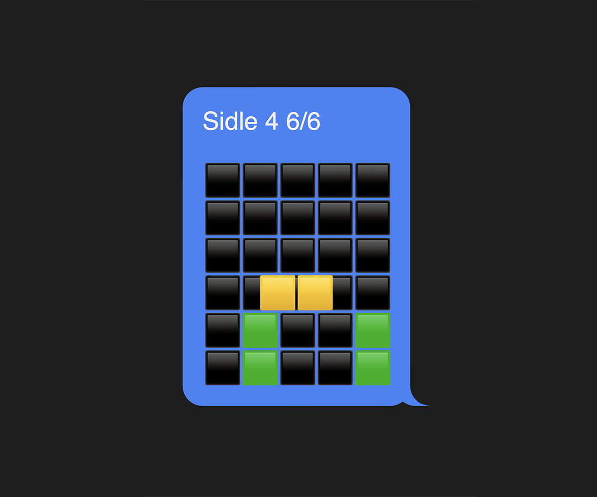

One of my favorite idea-having times is when I'm in bed, with my eyes closed, not quite asleep but not quite awake, in the hypnagogic state where the mind starts to make connections and realizations that it wouldn't normally make during the day. Oftentimes these thoughts aren't worth remembering, but sometimes I get out of bed and write them down, and sometimes they turn into yearlong side projects.

I had one such thought one night last May in my college apartment in Champaign, Illinois, and it followed me through graduation, into the summer, and to New York City, where over a year after conception, it became a real thing. It's a game, and it's called Sidle, and you can play it right now:

<a class="fancy-link" href="https://aaronson.org/sidle/" rel="noreferrer noopener" target="_blank">
    
    
        Sidle
    
</a>

## Character development

> _Spoiler alert! The rest of this post will reveal a lot about the design and gameplay of Sidle, which I highly encourage you try for yourself before reading on!_

I'm not sure how exactly the idea came to mind that fateful May evening, but I do know I must have been playing [Wordle](https://www.nytimes.com/games/wordle/index.html) (which I should specify, [for legal purposes](https://www.theverge.com/2024/3/8/24094234/ny-times-wordle-clones-files-dmca-copyright-takedowns-knockoffs), is not affiliated with Sidle). Like most people alive in the 2020s, I have a Wordle group chat—well, effectively it's just me and my friend Ming sending our Wordle results back and forth, with our friend Art silently lurking as a courtesy to keep the chat a group chat.

{: class="img-big"}

Surely, Wordle wouldn't be the viral sensation that it became if it wasn't for its emoji sharing mechanism, producing a grid of colored emoji squares that reflect the game's results, which can be conveniently copy-and-pasted and shared and spread like a yellow-and-green wildfire. And it's from these squares that my idea arose: what if the yellow square was a little guy who could jump around on the green squares? And what if the emoji grid [side-scrolled](https://en.wikipedia.org/wiki/Side-scrolling_video_game) like a classic platformer game?

I often find that coming up with a good name for something is a huge motivator for making it happen. Well, once I thought of the name Sidle ("side-scrolling" + "Wordle") (also just a word that means "move sideways") (also five letters, like a Wordle answer), it wasn't just an idea, it was happening.

You might be thinking that a platformer game seems pretty out-of-left-field coming from me, guy who makes [crosswords](https://aaronson.org/crosswords/) and [word searching tools](https://aaronson.org/wordlisted/) and [meme generators](https://aaronson.org/whisperer/), but if you've known me for long enough, this should come as no surprise.

{: class="img-right"}

I've never been that much of a gamer, but I did grow up on simple, high-concept Flash platformer games like [Shift](https://armorgames.com/play/751/shift/), [Tealy & Orangey](https://www.kongregate.com/games/freakyzoid/tealy-orangey), and [This Is the Only Level](https://armorgames.com/play/4309/this-is-the-only-level). So ever since I started programming in middle school, making a platformer game myself has been something of a personal white whale.

From [The Adventures of Orangle](https://scratch.mit.edu/projects/46413480/) in middle school, which I made using Scratch with my friend Josh Tang, to lackluster attempts at rudimentary JavaScript platformers in high school, to a C++ platformer called [Penguin Time](https://github.com/adamaaronson/penguin-time) in college (which is a pain in the ass to install, you're better off playing Orangle, it still holds up), the allure of the platformer has followed me throughout my life as a programmer, with my every attempt getting most of the way to a coherent game but falling short in some way or another. As it turns out, for being so intuitive to play, platformers are deceptively tricky to develop.

## Building blocks

They say form follows function. But in the case of Sidle, the game's form largely dictated its function. Since I wanted the game to look like the Wordle emoji grid, much of the game's functionality was locked in from the start:

-   Every block would be aligned to a square grid, but the player would be able to move fluidly throughout the grid (in my original conception of the game, the player would only be able to move to discrete positions in the grid, but luckily I realized that those physics would look super choppy and weird).
-   The visible window of the game would be 5x6 blocks (or smaller), leading to a sort of [fog-of-war](https://en.wikipedia.org/wiki/Fog_of_war) effect where the player can only see a small portion of the level at any given time.
-   There would be no other types of blocks besides the player, the ground, and the background, since Wordle emoji grids only have three different color squares. This means no extra entities like enemies or lava or moving platforms.

Since I'm a sucker for simple, elegant games, I also decided from the start that there would be no death conditions, no wall-jumping, and no other controls besides moving left and right and jumping. And unlike Wordle, there would be no words involved (I know, it's tough, I love words too). Constraints breed creativity!

Sidle's only functional gimmick, which only materialized partway through the development process, was that on some levels, the player could consist of multiple yellow blocks, the same way a Wordle emoji grid usually has multiple yellow squares. These yellow blocks (called `subentities` in the code) would necessarily be controlled jointly by the arrow keys, but I had the choice to either make the subentities move separately and collide with their environment independently, à la Tealy and Orangey in Tealy & Orangey; or move jointly, as if they were connected by invisible rods.

{: class="img-left"}

I went with the latter, and it resulted in some implications that defined Sidle's gameplay, especially in later levels where the player's subentities are physically disjunct. It meant that the player's collisions with the environment depended on an `or` operation on all of its subentities—a player made of two subentities is on the ground if one `or` the other subentity is on the ground. This meant that sometimes, instead of the player jumping from one platform to another, the platform sort of has to jump from one subentity of the player to another—an effect that becomes crucial in the last few jumps of level 10.

## Technical difficulties

The game took over a year to develop, not because I toiled at it consistently for over 12 months, but because I worked on it in discontinuous bursts amid life changes and occasional bouts of frustration.

> _Fair warning, this section gets a little technical! If you don't care about the technical details, feel free to skip to the last words._

I built Sidle in TypeScript and React, which is not a typical tech stack for a platformer game, but 1) I'm very comfortable working with it, and 2) it means the game can be a website, which means it can be played on any device with a web browser, without a finicky installation process (one of the pitfalls of my college-era platformer Penguin Time). I also used no graphics engine or game engine, opting instead to program the game's animation and physics from scratch using the built-in JavaScript [`requestAnimationFrame()`](https://developer.mozilla.org/en-US/docs/Web/API/window/requestAnimationFrame) method, CSS `top` and `left` positioning properties, and some basic high school physics formulas for velocity and acceleration.

### A wrinkle in time

There were two big wrinkles in the development process. The first was a direct result of my choice to eschew animation engines and rely entirely on the web browser's built-in animation capabilities.

Because different browsers have different refresh rates, I couldn't set the animation rate to a certain number of frames per second, and I couldn't measure the player entity's speed in pixels-per-frame. Instead, every frame, I had to measure the amount of time that had passed since the previous frame, and then calculate the player's new position based on its speed in pixels-per-second. But since a non-whole number of seconds will pass between each frame, that means the player's position will change by a non-whole number of pixels. This initially led to rounding errors that compounded over time and screwed up the physics, causing the player to occasionally clip into walls and fall through floors. Not good!

Many iterations and many long walks later, I landed on the solution to address this: keep track of the player's `position` and `unroundedPosition` in tandem, where the `unroundedPosition` includes the precise non-whole number of pixels, while the `position` is pixel-perfect, and reflects the player's actual visible position in the level. And if the player moves by multiple pixels from frame to frame, their `position` needs to interpolate to every pixel between the starting and ending point in order to check for collisions with blocks at every point. Much better!

### A wrinkle in, uh, space

The other big wrinkle, which happened to be another pitfall of Penguin Time, involved the player traversing one-block gaps. Since all the blocks are exactly the same size, the player should consistently fall into a one-block gap, rather than gliding over it, particularly in cases where it moves multiple pixels in one frame (Penguin Time had the gliding issue, which I suppose is apt for a penguin). As it turns out, getting the player to move intuitively into one-block gaps in the floor and walls was a tall task, requiring lots of brainstorming and hard-coding behavior for particular corner cases.

Here's a real sketch I made while trying to figure out which direction the player should go when it finds itself at the corner of a block. These cases ended up as `if`/`else` statements in the code almost verbatim:

{: class="img-big"}

When all was said and done, after several frustration-induced hiatuses, I had a fully functional, pixel-perfect, intuitive-feeling, home-cooked platformer engine. Sidle's full source code is available [here](https://github.com/adamaaronson/sidle) for you to peruse if you're so inclined.

## Last words

For something that started as a half-lucid idea, I'm truly happy with how Sidle turned out 13 months later. This game is a real testament to the "begin with the end in mind" principle (from [this book](https://en.wikipedia.org/wiki/The_7_Habits_of_Highly_Effective_People), which I half-love and half-hate)—I started with a vision, and I spent the entire development process chasing the vision and trying to make it a reality.

If you’ve read this far, I think it’s safe to assume you’ve tried playing Sidle. I hope you enjoyed the gradual progression of levels, where each one gently introduces a new mechanic to the game. I hope my year of on-and-off development was worth it for your 5-minute or 20-minute or 1-hour reprieve from life. I hope you share it with your Wordle group chat and thoroughly confuse them. And I hope that next time you're half-asleep and have a ridiculous idea, you consider writing it down.
