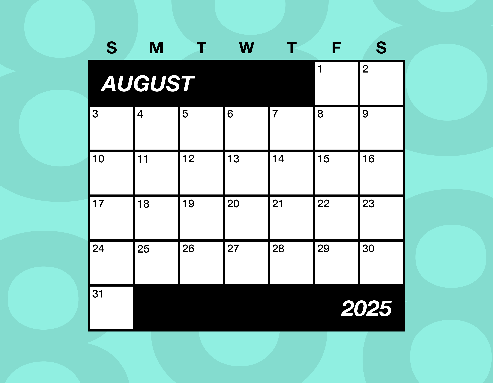
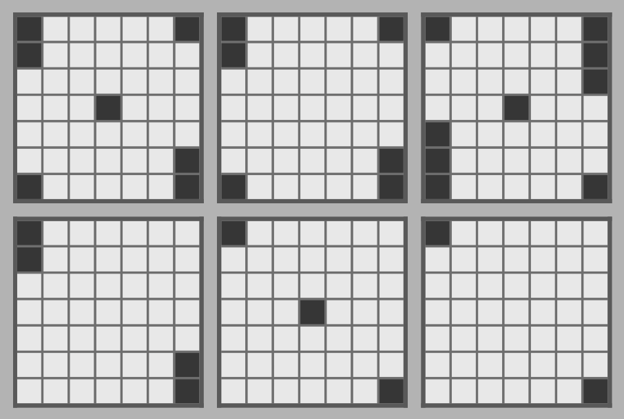
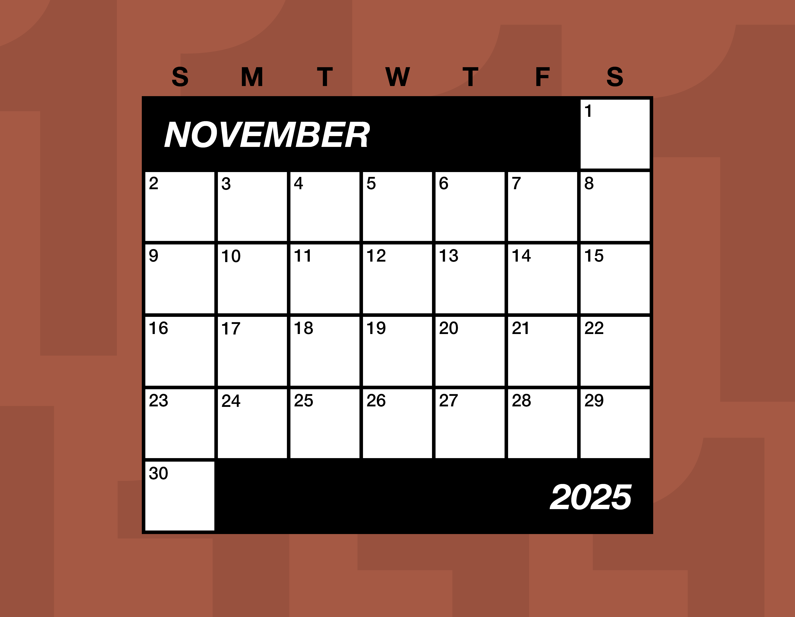
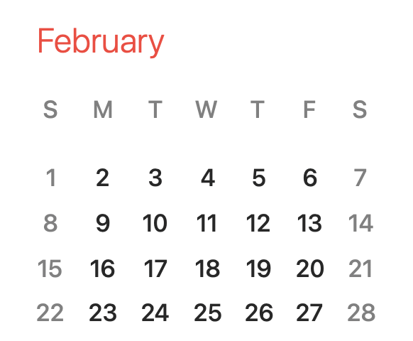
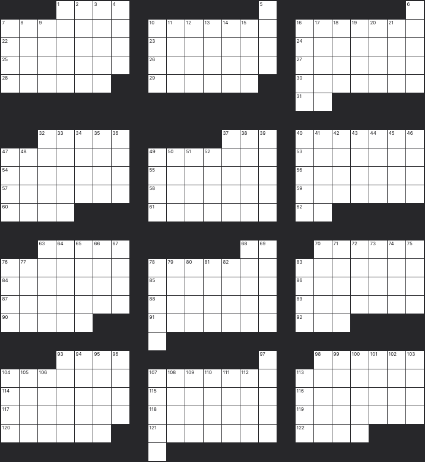
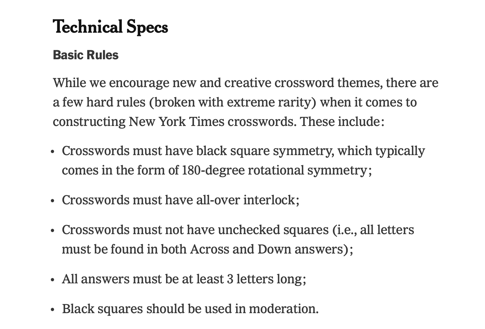
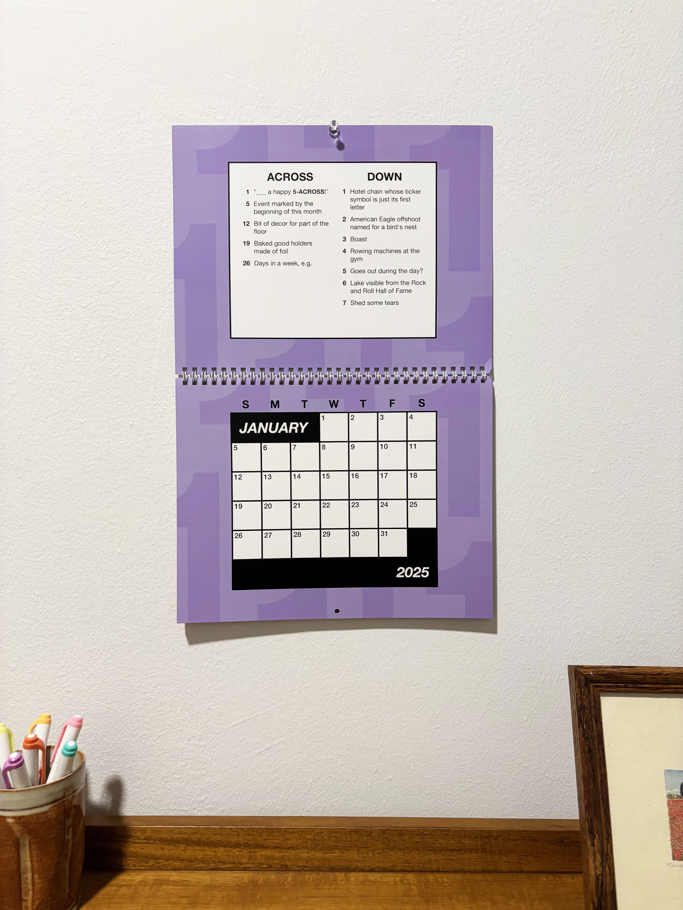

Ever heard of the Tetris effect? It's where you play so much Tetris that the game starts to seep into your thoughts, your dreams, your half-waking hallucinations, and pretty much every part of your reality that has nothing to do with Tetris. Well, I do a lot of crosswords—by "do" I mean both "solve" and "make"—and it turns out the "crossword effect" is also a very real thing.

Once you spend enough time with grids and clues in front of your face, everything becomes crosswords. You'll hear a new phrase and think, "is that in my wordlist?", you'll see two words on a sign and think "these would stack well in a grid!", you'll start dreaming of theme ideas that seem _genius_ while you're asleep only to wake up and realize they make no sense. But every now and then these intrusive thoughts will yield a coherent idea for a puzzle.

One night this March, crosswords must have been permeating my consciousness as I was half-asleep, because I had a thought so intrusive that it catapulted me out of bed and onto my phone. At 12:57 am, I messaged my friends:

> 💭 Crossword calendar (each month's calendar is a crossword grid where each day is a square)

> Ok back to bed now

Eight months later, that idea has become a real thing—a physical object!—that you can buy right now and hold in your hands before the holidays. Introducing the 2025 Crossword Calendar:

<a class="fancy-link" href="https://crosswordcal.com/products/2025-crossword-calendar" rel="noreferrer noopener" target="_blank">
    
    
        2025 Crossword Calendar
    
</a>

    
    

It's a folding wall calendar where each month is a crossword to solve, the grid taking the shape of the month's calendar grid, with one letter to write in each day's square. The grid squares are numbered like a regular calendar, with each clue enumerated by the day of the month its answer starts on.

The road from half-waking idea to physical object was a winding one, especially considering this was the first time I'd ever tried to create a real product that people can buy. Here's how it went down (and across).

## On the grid

The concept of a crossword shaped like a monthly calendar immediately poses a few questions.

### 1. What about the two-letter words?

In typical American-style crosswords, the minimum word length is three letters, because inaugural _New York Times_ crossword editor Margaret Farrar [said so](https://www.theguardian.com/crosswords/crossword-blog/2012/dec/03/1). But some months start on a Friday or end on a Monday (like March, June, and August 2025), requiring two-letter words going across at the beginning or end of the month. So with regrets to Margaret, two-letter words are here to stay, treated no differently in the calendar from any other length word.

### 2. What about the unchecked squares?

{: class="img-right"}

Similarly, American-style crosswords don't allow "unchecked squares"—squares that are only part of a word going in one direction and not the other. This means every square in a crossword is part of two words, so if you don't know a clue going one way, you always have the crossing clues to help figure out each letter. This is also a [Farrar-established rule](https://time.com/5811396/crossword-history/), and it's one of the key differences between American- and British-style crosswords.

Well, some months start on a Saturday or end on a Sunday (or both, in the case of November 2025), leaving an unchecked square in the first or last day of the grid. Rather than cluing these as one-letter words, which I think would have been a little confusing, I just made sure the words crossing the unchecked squares were both common (no names or obscure words that people might not know the unchecked letter of) and unambiguous (no clues like "Some Greek letters" for the entry \_ETAS).

### 3. Isn't that pretty hard to fill with words?

Pretty hard, but not impossible. My prevailing theory as to why seemingly no one has made a crossword calendar before is that filling a wide open 7x4-ish grid American-crossword-style is kind of a pain, and doing it 12 times is kind of 12 pains. With [computer assistance](https://ingrid.cx), it's pretty easy to fill a monthly grid with crappy words, but to fill one cleanly, with regular words that normal people know, it takes a lot of trial and error and/or an immaculately scored crossword wordlist.

{: class="img-left"}

Luckily, I've [made enough crosswords](https://aaronson.org/crosswords/) at this point that my wordlist scores are refined enough and, crucially, I've become numb enough to the trial-and-error process, that making a grid for each of the 12 months didn't strike me as too daunting of a challenge. The wide-openness of the grids wasn't too dissimilar to [some](https://www.7xwords.com/daily/09/09-15.html) of the [grids](https://www.7xwords.com/daily/12/12-29.html) I filled for 7xwords, the project by Malaika Handa that enumerated every possible symmetrical 7x7 crossword grid.

So I just went ahead and did it. And yeah, it was kind of a pain, but after a few weeks I had 12 grids, one for each month, collectively filled with 365 letters, one for each day of 2025.

## Really important calendar facts

Working on this project has given me a newfound appreciation for the shapes of calendar months. It's pretty neat that every month has a unique shape—like a fingerprint—that defines the form its crossword must take. And since the number of days of the year isn't divisible by 7, the starting day of each month changes every year, which means each month's crossword grid is completely different depending on what year it's for.

Calendarheads, tap in. Here are some facts about calendar shapes that are sure to go over well at parties:

-   Monthly calendar grids usually have 5 rows, because most months have 30 or 31 days, which is a little more than 4 weeks. But if a 30-day month starts on a Saturday or a 31-day month starts on a Friday or Saturday, you'll get an extra day or two at the end of the month, which necessitates a 6th row. It feels wrong that a month, which we think of as 4-ish weeks, could require 6 rows, but sometimes that's just the way the cookie crumbles.

{: class="img-small"}
 

-   Very rarely, a February will start on a Sunday, allowing it to squeeze onto 4 rows if it's not a leap year. But it won't be long—in 2026, the shape of February will be a perfect 4x7 rectangle. It's gonna be a movie.

{: class="img-small"}
 

-   I was curious if each month in a given year had a unique shape, or if there were any repeated shapes throughout the year. As it turns out, January and October are the only pair of months in 2025 with the same shape, since they start on the same day of the week and both have 31 days. This holds true every year, except for leap years, when January and July are the only twin months. This information feels a little bit cursed, since it's always been true, but no one talks about it.

    
    

## Putting it out there

Well now I had 12 little crosswords shaped like the 12 months of 2025, but the question still stood: what do I do with them? I basically made an ultimatum to myself: if I can't find someone to publish the calendars for me, I'll figure out how to do it myself.

My first thought was to pitch it to an existing calendar company, or maybe an existing crossword book company, and see if they're interested in branching out to make my weird thing a reality. So back in March and April I tried floating the idea to a few places, but no one was biting.

Then I had a really silly second thought, which was to put all twelve months into one giant crossword grid and [submit it](https://www.nytimes.com/article/submit-crossword-puzzles-the-new-york-times.html) to _The New York Times_ as a Sunday crossword. Yeah, I was kind of sick and twisted for this, but if you put all twelve months together and pad them with black squares, they make this garish 23x25 grid with 142 words, which just so happens to barely exceed the typical Sunday size of 21x21 with 140 words.

{: class="img-small"}

Filled with words and clued with clues, it was a fully functional crossword, so in May, I went ahead and submitted it to the NYT just like any other puzzle. But you might be thinking this grid seems a bit unconventional for a NYT crossword, and you could not be more right—the NYT crossword submission specs list five "basic rules" for crossword grids, and this grid breaks _all five_ of them:

{: class="img-medium"}

-   The grid has no symmetry.
-   The white space of the grid is segmented into 12 disconnected sections, which means it does not have "all-over interlock" (side note: I've always thought "all-over interlock" was a super unintuitive term that requires clarification every time it's said, but crossword people love to casually throw it around as if it makes perfect sense).
-   The grid has five unchecked squares.
-   The grid has three two-letter words.
-   The typical Sunday grid has about 80 black squares, while this grid has uhhhh 210. But who's counting!

For what it's worth, any of these rules are allowed to be "broken with extreme rarity" if a theme calls for it—and I thought, hey, the theme calls for it. But suffice to say, a few months later, an email from the NYT crossword editors hit my inbox with regrets, concluding that "this would seem too much like solving 12 mini puzzles." Can't argue with that—12 mini puzzles is literally what this is, so they kinda nailed it. Maybe I should be the one sending my regrets to them for making them spend time reviewing the puzzle.

I could have tried shipping this Franken-grid to other crossword outlets, but I figured the NYT is generally the most flexible of the major outlets when it comes to funky rule-breaking grids, and it was go big or go home. So go home it was.

## Bringing it home

With all my reasonable choices for external publishers exhausted, I pretty much had one choice left, which was to make the calendars myself. The obvious perk of doing it this way is that I have full control over the calendars' design and editorial process, and the obvious drawback is that when it comes to publishing a physical product, I had no idea what I was doing.

{: class="img-right"}

So I asked some friends who do have experience making physical products (shoutouts to Parker Higgins, Taylor Tabb, Alice Getmanchuk, Matthew Sisson, and Leia Chang for their suggestions), discovered that [print on demand](https://en.wikipedia.org/wiki/Print_on_demand) is an industry that exists, found a provider that makes fully customizable wall calendars ([Printify](https://printify.com), which handles manufacturing and fulfillment), and finally made an online store with [Shopify](https://www.shopify.com) that integrates directly with Printify. I designed the calendars in good old-fashioned [Photoshop](https://www.adobe.com/products/photoshop.html), hand-placing every square and number and manually typesetting every clue.

And that brings us to today, when [crosswordcal.com](https://crosswordcal.com) is a website on the internet where you can buy the 2025 Crossword Calendar for $20.25 USD. Many have been asking me, "Is next year's gonna be $20.26? Isn't that cheaper than inflation?" And to them I say, "I'm a man of the people!"

I might be biased, but I'd say the calendar makes an excellent gift for a word enjoyer—the puzzles are medium difficulty and designed to be beginner-friendly, so you don't have to be a crossword expert to enjoy them. And again, biased, but I think it looks pretty neat on a wall.

Should you solve all the puzzles at the beginning of the year? Should you solve each one at the beginning of each month? Should you write in one letter a day? Should you just solve the one for your birthday month so you can see what letter your birthday is? Do whatever you want—I don't make the rules, I just write the clues.

<a class="fancy-link" href="https://crosswordcal.com/products/2025-crossword-calendar" rel="noreferrer noopener" target="_blank">
    
    
        2025 Crossword Calendar
    
</a>
